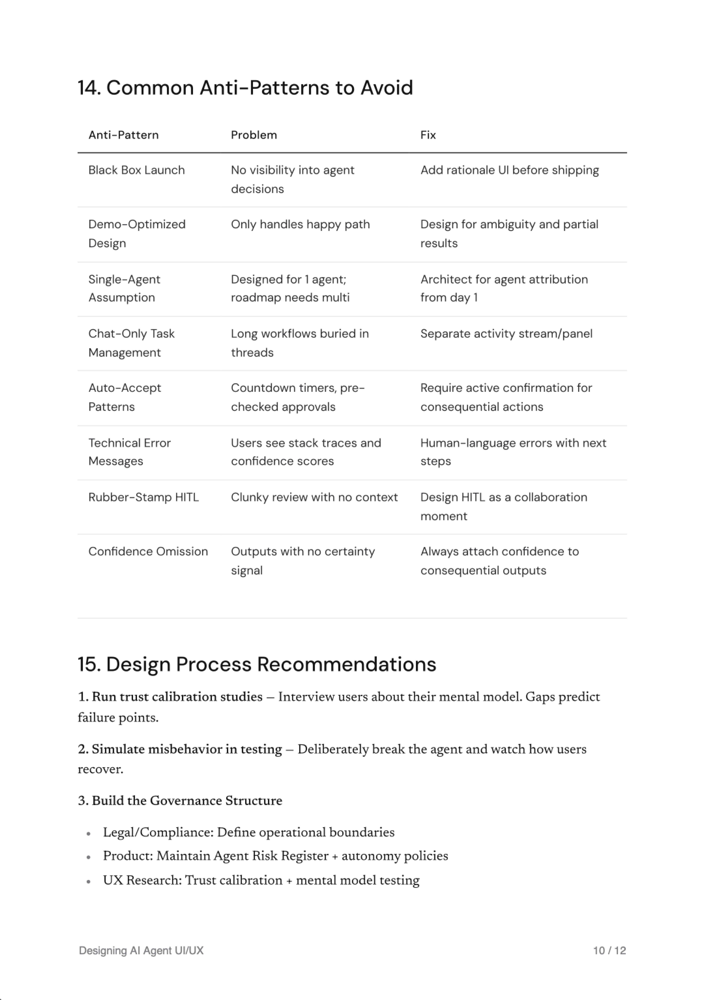

# pdf-it

[](https://glama.ai/mcp/servers/mrslbt/pdf-it)
[](https://lobehub.com/mcp/mrslbt-pdf-it)
[](https://www.npmjs.com/package/pdf-it-mcp)
[](https://www.npmjs.com/package/pdf-it-mcp)
[](LICENSE)

A Model Context Protocol (MCP) server and Claude Code skill that turns markdown into PDFs that look like they were made on purpose. Cover page, table of contents, code blocks that hold across page breaks, page-numbered footer. One command from your Claude session to a file you can send to a client.


## Why this exists

Every Claude Code research session ends the same way: a wall of useful markdown and no clean way to turn it into a PDF a person would actually want to read.

Chrome print: takes 30 seconds, output looks like a Word doc. Manual HTML conversion: 10 minutes per document. Pandoc: works but defaults look like a 2008 academic paper. None of it produces an artifact you would send to a client.

`pdf-it` is one command. The output is designed by default.



A 12-page sample is in [`examples/designing-ai-agent-uiux.pdf`](./examples/designing-ai-agent-uiux.pdf).

## Works with

`pdf-it` is a standard Model Context Protocol server. Any client that supports MCP locally can use it.

| Client | Supported | How to add |
|---|---|---|
| Claude Desktop (Mac, Windows) | yes | Edit `claude_desktop_config.json` |
| Claude Code (CLI) | yes, plus skill triggers like "save this as PDF" | `claude mcp add pdf-it -- npx -y pdf-it-mcp` |
| Cursor | yes | Edit `~/.cursor/mcp.json` |
| Cline (VS Code extension) | yes | Edit Cline's MCP settings |
| Continue.dev | yes | Add via Continue's MCP config |
| Zed | yes | Standard MCP config |
| Goose (Block's CLI) | yes | Standard MCP config |
| Custom agents via the Anthropic SDK | yes | Wire MCP yourself |
| claude.ai (browser) | no | Web does not run local MCP servers |
| Claude iOS / Android | no | Mobile does not run local MCP servers |

Hard requirements on any client: Node.js 18 or newer, Google Chrome installed, the client must support MCP.

## Install

```bash
npm install -g pdf-it-mcp
```

Or run on demand with `npx pdf-it-mcp`.

### Requirements

- Node.js 18 or newer
- Google Chrome installed (used as the renderer, no extra download)

## Configure

### Claude Desktop

Edit `claude_desktop_config.json`:

```json
{
  "mcpServers": {
    "pdf-it": {
      "command": "npx",
      "args": ["-y", "pdf-it-mcp"]
    }
  }
}
```

### Claude Code

```bash
claude mcp add pdf-it -- npx -y pdf-it-mcp
```

### Cursor

Add to `~/.cursor/mcp.json`:

```json
{
  "mcpServers": {
    "pdf-it": {
      "command": "npx",
      "args": ["-y", "pdf-it-mcp"]
    }
  }
}
```

### Custom Chrome path

If Chrome lives somewhere non-standard:

```json
{
  "mcpServers": {
    "pdf-it": {
      "command": "npx",
      "args": ["-y", "pdf-it-mcp"],
      "env": { "CHROME_PATH": "/path/to/chrome" }
    }
  }
}
```

## Use

In any Claude session connected to the server, ask:

> Save this as a PDF

Or any of these phrasings: `export as PDF`, `make a PDF report from this`, `turn this into a PDF`, `/pdf`. The skill picks up the request and routes it through pdf-it. The output lands in `~/Documents/pdf-it/` by default.

## Tools

| Tool | Description |
|---|---|
| `generate_pdf` | Convert markdown into a PDF. Accepts a template (`research-report` or `plain`), optional title and author for the cover, and an optional output path. |
| `list_templates` | Return the list of available templates with descriptions. |

### `generate_pdf` parameters

| Parameter | Required | Description |
|---|---|---|
| `content` | yes | Markdown string to convert |
| `title` | no | Shown on the cover and in the page footer |
| `author` | no | Shown on the cover |
| `output_path` | no | Absolute path for the output. Defaults to `~/Documents/pdf-it/{slug}-{timestamp}.pdf` |
| `template` | no | `research-report` (default) or `plain` |

## Templates

| Name | Description |
|---|---|
| `research-report` | Cover page with title, author, and date. Auto-generated table of contents from H1 and H2 headings. Body with proper hierarchy. Footer with title and page number. Best for research, summaries, design docs, reports. |
| `plain` | No cover, no TOC. Dense body content only. Best for short notes and quick exports. |

## Skill

This package ships with a Claude Code skill at `SKILL.md`. Trigger phrases the skill responds to:

- `save this as PDF`
- `export as PDF`
- `make a PDF report from this`
- `turn this into a PDF`
- `generate a PDF`
- `/pdf`

See [SKILL.md](./SKILL.md) for the full skill spec.

## Examples

The [examples](./examples) folder has a sample generated PDF (`designing-ai-agent-uiux.pdf`, 12 pages) and the cover and body screenshots used in this README.

## Output

By default PDFs are written to `~/Documents/pdf-it/{slug}-{timestamp}.pdf`. Pass `output_path` to override.

## Design

System fonts where possible. Inter for body and headings, JetBrains Mono for code, page numbers, and metadata. Pure white paper, near-black ink, neutral hairline borders, no accent colors. Code blocks render without syntax highlighting on purpose: color choices in PDFs age badly.

If you want a different design language, fork the templates and adjust. They live in `src/templates/` and are plain HTML and CSS rendered through Puppeteer.

## How it works

1. **Parse:** `markdown-it` converts your markdown to HTML and auto-generates a table of contents from H1 and H2 headings.
2. **Template:** the HTML is wrapped in templated CSS (Inter for body, JetBrains Mono for code, neutral palette).
3. **Render:** Puppeteer launches your local Chrome in headless mode and prints the HTML to PDF with proper page-break logic.
4. **Footer:** `pdf-lib` adds a page-numbered footer programmatically, skipping cover and TOC pages.
5. **Output:** the PDF lands in `~/Documents/pdf-it/{slug}-{timestamp}.pdf`.

Total time: 2-3 seconds for a 5-page document, 8-10 seconds for a 30-page document.

## Recognition

Listed on [npm](https://www.npmjs.com/package/pdf-it-mcp), [Glama](https://glama.ai/mcp/servers/mrslbt/pdf-it), [LobeHub](https://lobehub.com/mcp/mrslbt-pdf-it), [mcp.so](https://mcp.so/), and [mcpmux](https://mcpmux.com/).

## License

MIT. See [LICENSE](./LICENSE).

---

*Built by [Marsel Bait](https://marselbait.me). Sixth shipped MCP. Tokyo-based. Open to senior product design roles, especially in AI-native companies.*
