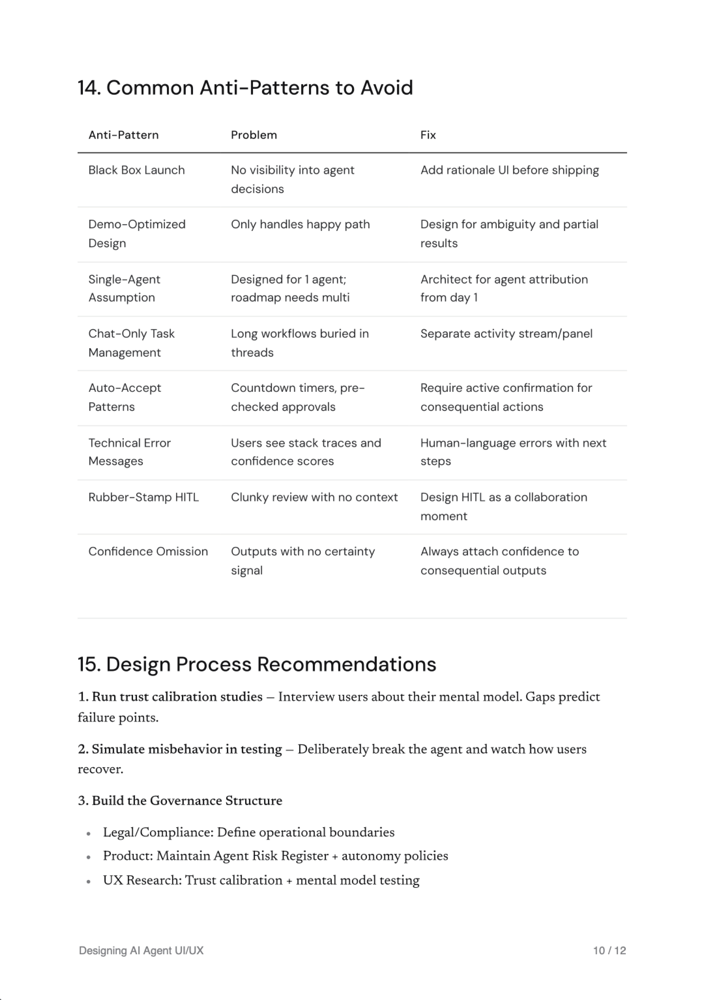

# pdf-it

[](https://glama.ai/mcp/servers/mrslbt/pdf-it)
[](https://lobehub.com/mcp/mrslbt-pdf-it)
[](https://www.npmjs.com/package/pdf-it-mcp)
[](https://www.npmjs.com/package/pdf-it-mcp)
[](LICENSE)

A Model Context Protocol (MCP) server and Claude Code skill that turns markdown into PDFs that look like they were made on purpose. Cover page, table of contents, code blocks that hold across page breaks, page-numbered footer. One command from your Claude session to a file you can send to a client.

Native renderer, no Chrome dependency. Fonts are embedded, so every PDF looks the same on every machine.


## Why this exists

Every Claude Code research session ends the same way: a wall of useful markdown and no clean way to turn it into a PDF a person would actually want to read.

Chrome print: takes 30 seconds, output looks like a Word doc. Manual HTML conversion: 10 minutes per document. Pandoc: works but defaults look like a 2008 academic paper. None of it produces an artifact you would send to a client.

`pdf-it` is one command. The output is designed by default.



## Install

```bash
npm install -g pdf-it-mcp
```

Or run on demand with `npx pdf-it-mcp`.

### Requirements

- Node.js 20 or newer
- No Chrome, no extra binaries. Fonts and renderer ship inside the package.

## Configure

### Claude Desktop

Edit `claude_desktop_config.json`:

```json
{
  "mcpServers": {
    "pdf-it": {
      "command": "npx",
      "args": ["-y", "pdf-it-mcp"]
    }
  }
}
```

### Claude Code

```bash
claude mcp add pdf-it -- npx -y pdf-it-mcp
```

### Cursor

Add to `~/.cursor/mcp.json` with the same shape as Claude Desktop.

### Cline / Continue / Zed / Goose

Standard MCP config. Same `npx -y pdf-it-mcp` command.

## Use

In any Claude session connected to the server, ask:

> Save this as a PDF

Or any of these phrasings: `export as PDF`, `make a PDF report from this`, `turn this into a PDF`, `/pdf`. The skill picks up the request and routes it through pdf-it. The output lands in `~/Documents/pdf-it/` by default.

## Tools

| Tool | Description |
|---|---|
| `generate_pdf` | Convert markdown into a PDF. Accepts a template (`research-report` or `plain`), optional title and author for the cover, and an optional output path. |
| `list_templates` | Return the list of available templates with descriptions. |

### `generate_pdf` parameters

| Parameter | Required | Description |
|---|---|---|
| `content` | yes | Markdown string to convert |
| `title` | no | Shown on the cover and in the page footer |
| `author` | no | Shown on the cover above the date |
| `output_path` | no | Absolute path for the output. Defaults to `~/Documents/pdf-it/{slug}-{timestamp}.pdf` |
| `template` | no | `research-report` (default) or `plain` |

## Templates

| Name | Description |
|---|---|
| `research-report` | Cover page with title, author, and date. Auto-generated table of contents from H1 and H2 headings. Body with proper hierarchy. Footer with title and page number. Best for research, summaries, design docs, reports. |
| `plain` | No cover, no TOC. Dense body content only. Best for short notes and quick exports. |

## Skill

This package ships with a Claude Code skill at `SKILL.md`. Trigger phrases the skill responds to:

- `save this as PDF`
- `export as PDF`
- `make a PDF report from this`
- `turn this into a PDF`
- `generate a PDF`
- `/pdf`

See [SKILL.md](./SKILL.md) for the full skill spec.

## Output

By default PDFs are written to `~/Documents/pdf-it/{slug}-{timestamp}.pdf`. Pass `output_path` to override.

## Design

Three families ship inside the package:

- **Newsreader** for the cover title (display 60, light) and body H1 (display 32). High-contrast serif that holds editorial weight at large sizes.
- **DM Sans** for H2, H3, table type, and the TOC heading. Quieter sub-hierarchy.
- **JetBrains Mono** for page numbers, metadata, code, and figure captions.

Pure white paper, near-black ink (#111113), secondary ink for date and table cells (#2B2B2E), muted gray for page numbers and date (#7A7A7E), hairline borders (#E6E6E6). No accent colors. Code blocks render without syntax highlighting on purpose: color choices in PDFs age badly.

Every value lives in `src/templates/design-tokens.ts` as the single source of truth. If you want a different design language, fork the components. They live in `src/templates/components/` and are plain React-PDF components with a small surface area.

## How it works

1. **Parse:** remark converts your markdown into an AST.
2. **Compose:** the AST becomes typed React components (Cover, TOC, and body primitives like H1/H2/H3, Paragraph, CodeBlock, Blockquote, Table, lists, and charts).
3. **Render:** `@react-pdf/renderer` rasterizes the React tree into a deterministic PDF with embedded fonts and TOC anchors.
4. **Output:** the PDF lands in `~/Documents/pdf-it/{slug}-{timestamp}.pdf` with title/author metadata embedded.

Total time: typically sub-second for a 5-page document, 1-2 seconds for a 30-page document.

## Recognition

Listed on [npm](https://www.npmjs.com/package/pdf-it-mcp), [Glama](https://glama.ai/mcp/servers/mrslbt/pdf-it), [LobeHub](https://lobehub.com/mcp/mrslbt-pdf-it), [mcp.so](https://mcp.so/), and [mcpmux](https://mcpmux.com/).

## Disclaimer

This is an unofficial, community-built tool. It is not affiliated with, endorsed by, or sponsored by Anthropic PBC. Claude and Claude Code are trademarks of Anthropic PBC.

`pdf-it` runs locally and ships its own renderer (`@react-pdf/renderer`) and fonts. Use at your own risk. The author accepts no liability for issues arising from misuse, prompt injection, bugs, or rendering failures.

## License

MIT. See [LICENSE](./LICENSE).
